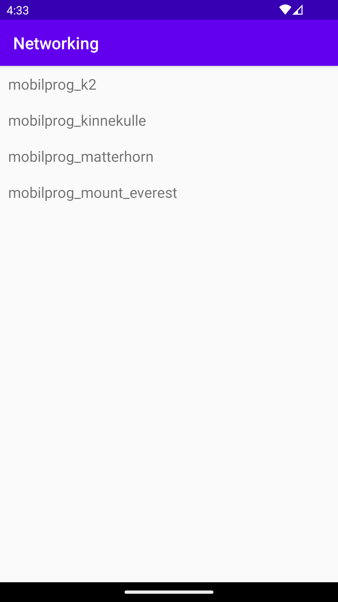

# Rapport
I added Recycler View Layout:
```
<LinearLayout xmlns:android="http://schemas.android.com/apk/res/android"
    android:layout_width="match_parent"
    android:layout_height="wrap_content"
    android:orientation="horizontal"
    android:padding="10dp">

    <TextView
        android:id="@+id/title"
        android:layout_width="wrap_content"
        android:layout_height="wrap_content"
        android:textSize="18sp" />

</LinearLayout>
```

I added an `ArrayList<Mountain>` as a member variable in Main activity:
```
ArrayList<Mountain> listOfMountains;
```
I added a `RecyclerView.Adapter` in Main activity as a member variable.

```
RecyclerViewAdapter adapter;

adapter = new RecyclerViewAdapter(this, listOfMountains, new RecyclerViewAdapter.OnClickListener() {
            @Override
            public void onClick(Mountain item) {
                Toast.makeText(MainActivity.this, item.getName(), Toast.LENGTH_SHORT).show();
            }
        });
```

I created RecyclerView.Adapter and a RecyclerView.ViewHolder by creating a new Adapter class:
Wit the method getItemsCount we get the size of the list. With addData method we get the updated list with data.
'onCreateViewHolder' inflates the data to be shown.
```
class RecyclerViewAdapter extends RecyclerView.Adapter<RecyclerViewAdapter.ViewHolder> {

    private List<Mountain> items;
    private LayoutInflater layoutInflater;
    private OnClickListener onClickListener;

    RecyclerViewAdapter(Context context, List<Mountain> items, OnClickListener onClickListener) {
        this.layoutInflater = LayoutInflater.from(context);
        this.items = items;
        this.onClickListener = onClickListener;
    }

    @Override
    @NonNull
    public ViewHolder onCreateViewHolder(@NonNull ViewGroup parent, int viewType) {
        return new ViewHolder(layoutInflater.inflate(R.layout.recyclerview_item, parent, false));
    }

    @Override
    public void onBindViewHolder(ViewHolder holder, int position) {
        holder.title.setText(items.get(position).getID());

    }
    @Override
    public int getItemCount() {
        return items.size();
    }

    public class ViewHolder extends RecyclerView.ViewHolder implements View.OnClickListener {
        TextView title;

        ViewHolder(View itemView) {
            super(itemView);
            itemView.setOnClickListener(this);
            title = itemView.findViewById(R.id.title);
        }

        @Override
        public void onClick(View view) {
            onClickListener.onClick(items.get(getAdapterPosition()));
        }
    }

    public void addData(List<Mountain> newdata){
        this.items=newdata;
    }

    public interface OnClickListener {
        void onClick(Mountain item);
    }
}
```
I used addData() to download json data by changing the JSON_URL and wrote the code in onPostExecute().

```
 private final String JSON_URL = "https://mobprog.webug.se/json-api?login=brom";
 private final String JSON_FILE = "mountains.json";
   
 new JsonFile(this, this).execute(JSON_FILE);
 new JsonTask(this).execute(JSON_URL); 
    
   Gson gson = new Gson();
        Type type = new TypeToken<List<Mountain>>() {}.getType();
        listOfMountains = gson.fromJson(json, type);

        adapter.addData(listOfMountains);
```
 I made it possible to display the names of the mountains in the `RecyclerView` by creating 
 getter and setters for the names and getting the positions with `onBindViewHolder`:

```
public class Mountain {

    public static int length;
    private String ID;
    private String name;
    @SerializedName("size")

    public String getName() {
        return name;
    }
    public void setName(String name) {
        this.name = name;
    }

    public String getID() {
        return ID;
    }
    public void setID(String ID) {
        this.ID = ID;
    }

}
```

```
 @Override
    public void onBindViewHolder(ViewHolder holder, int position) {
        holder.title.setText(items.get(position).getName());
    }
```
This is the Recycler View with titles and ID. Tried to add them in one screen but didn't work.




